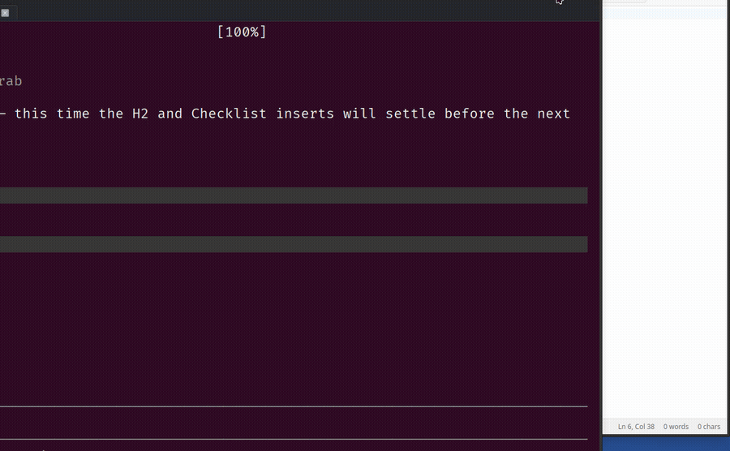

# bad-ass-mcp

A cross-platform MCP server for desktop GUI automation — driven by accessibility APIs, not screenshots.

Works with Claude, Codex, Gemini, Ollama, or any OpenAI-compatible client that supports MCP.


*bad-ass-mcp recording itself interacting with [MarkTheCrab](https://github.com/HoldMyBeer-gg/MarkTheCrab)*

## Why

Most AI desktop automation tools work by taking screenshots and asking a vision model "what do you see?" That's slow, expensive, and fragile.

Every major OS exposes a structured accessibility tree — the same one used by screen readers — that describes every button, text field, combo box, and menu in every running application. **bad-ass-mcp** speaks that language directly.

- **Linux**: AT-SPI2 via `gi.repository.Atspi`
- **Windows**: UI Automation *(coming soon)*
- **macOS**: AXUIElement *(coming soon)*

Actions fire on control objects directly, so the target window doesn't need focus. The user can keep working while automation runs in the background.

## Tools

| Tool | Description |
|------|-------------|
| `list_windows` | List all visible application windows |
| `get_tree` | Full accessibility tree for a window as nested JSON |
| `find_elements` | Find elements by role and/or name |
| `click` | Click / invoke an element (foreground-independent) |
| `type_text` | Type text into a field (SetValue → EditableText → key injection) |
| `select_option` | Select an option in a combo box or list |
| `get_value` | Get the current value or text of an element |
| `wait_for_window` | Wait until a window matching a pattern appears |
| `wait_for_element` | Wait until an element exists and optionally has a given state |
| `screenshot` | Capture a PNG as base64 (last resort — prefer the tree) |
| `start_recording` | Start recording the screen (or a specific window) |
| `stop_recording` | Stop recording and export as a GIF |

## Installation

**Requirements**: Python 3.11+, `ffmpeg` + `gifsicle` for recording (optional)

```bash
pip install bad-ass-mcp
```

On Linux, AT-SPI must be enabled. Most desktop environments (GNOME, KDE, XFCE) have it on by default. If not:

```bash
# Check
gsettings get org.gnome.desktop.interface toolkit-accessibility

# Enable
gsettings set org.gnome.desktop.interface toolkit-accessibility true
```

### Register with Claude Code

```bash
claude mcp add bad-ass-mcp --scope user -- bad-ass-mcp
```

Or manually in `~/.claude.json`:

```json
{
  "mcpServers": {
    "bad-ass-mcp": {
      "type": "stdio",
      "command": "bad-ass-mcp"
    }
  }
}
```

## Usage

```
list the windows on screen
→ [{ "id": "12345", "name": "Firefox", ... }]

find the search box in window 12345 and type "hello"
→ find_elements(window_id="12345", role="entry")
→ type_text(handle_id="...", text="hello")
```

For apps that don't expose a clean accessibility tree (WebKit-based editors, Electron apps), `type_text` falls back to AT-SPI keyboard injection automatically.

## Architecture

```
bad_ass_mcp/
├── server.py          # FastMCP tool definitions
├── types.py           # WindowInfo, ElementHandle, ActionResult, StaleHandleError
└── backend/
    ├── base.py        # Abstract DesktopBackend interface
    ├── linux.py       # AT-SPI implementation (complete)
    ├── windows.py     # UIA stub (coming soon)
    └── macos.py       # AXUIElement stub (coming soon)
```

The abstract backend interface means adding a new platform is just implementing one class. The same 24 contract tests run against every backend via `FakeBackend`.

## Releasing

Tag a version and the release workflow builds and attaches the wheel automatically:

```bash
git tag v0.2.0 && git push --tags
```

## License

MIT
