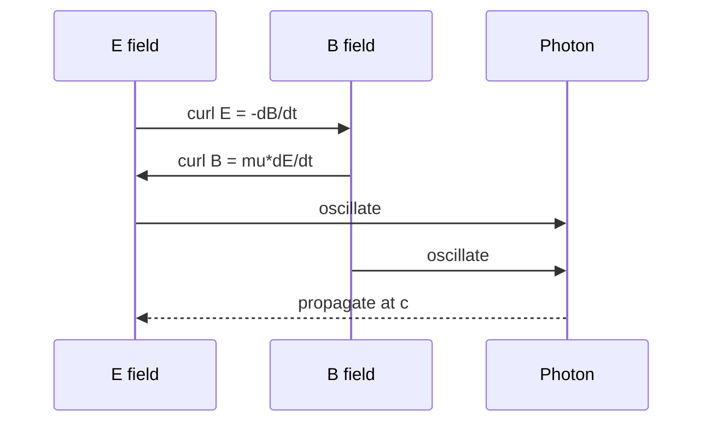

# Maxwell's Equations

The four fundamental laws of electromagnetism:

$$\begin{aligned}
\nabla \cdot \mathbf{E} &= \frac{\rho}{\varepsilon_0} \\
\nabla \cdot \mathbf{B} &= 0 \\
\nabla \times \mathbf{E} &= -\frac{\partial \mathbf{B}}{\partial t} \\
\nabla \times \mathbf{B} &= \mu_0\mathbf{J} + \mu_0\varepsilon_0\frac{\partial \mathbf{E}}{\partial t}
\end{aligned}$$

The speed of light emerges directly: $c = \dfrac{1}{\sqrt{\mu_0\varepsilon_0}}$

## Field Coupling

